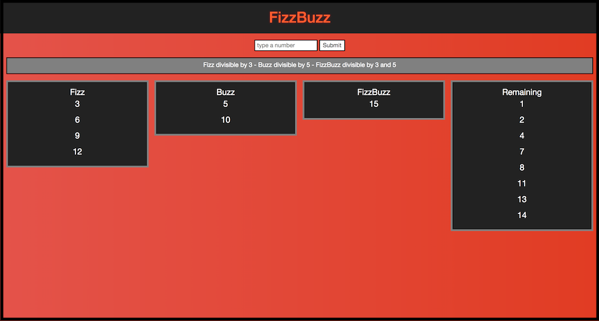
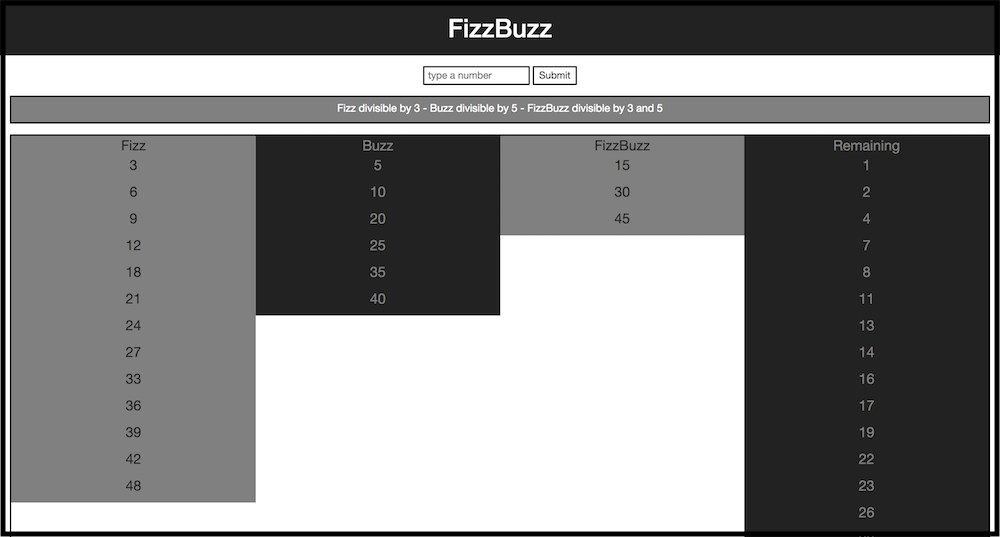

FizzBuzz is a simple programming task commonly used in software developer job interviews.
In this example, the app grabs the users input and display the numbers in the corresponding area,
numbers divisible by 3 goes on the Fizz column, divisible by 5 goes on the Buzz column, divisible by both 3 and 5 goes 
on the FizzBuzz column, and the remaining numbers goes on the remaining column.

#### Test the project. 
https://robydoidao2006.github.io/fizzbuzz/

V.2.0 ~ Date: 11/02/2018
##### Visual Inprovements 
- Custom glowing h1
- Custom background color 
- Better Design layout
##### Logic Inprovements
- Grabs user input accurately 
- Only accepts numbers as input

V.1.0 ~ Date: 11/01/2018.
- Grabs user input, and display the numbers on the right columns!

